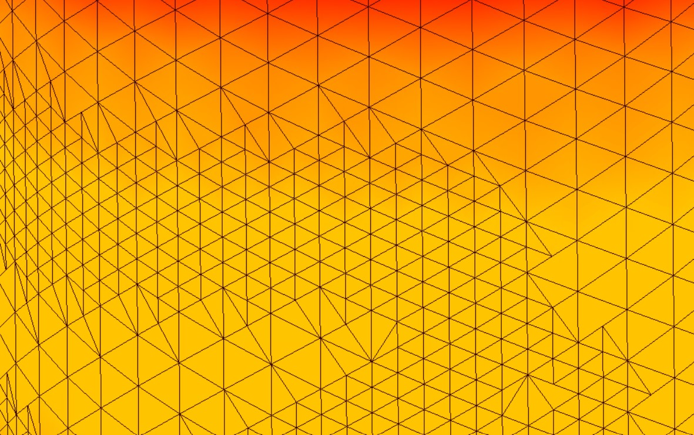

# bsim_amr
Adaptive mesh refinement algorithm based on the RGB-refinement technique

This algorithm provides a refinement strategy for BSIM blow molding simulation. The refinement is based on a refinement strategy proposed in 
-W. Dörfler, “A Convergent Adaptive Algorithm for Poisson’s Equation”, SIAM
Journal on Numerical Analysis, Jg. 33, Nr. 3, S. 1106–1124, 1996.

The following refinement strategies are used:

Note that the marking strategy itself is not based on the algorithm that is proposed by Willy Dörfler. At the moment, the marking of an element
is based on the thickness difference between undeformed and deformed shell element. Additional marking strategies should be used to get a better result.

**Current status**

Solved most of the rotation problems and the mesh looks good in most parts. 

In some parts there are still hanging nodes which occur because of a bug
in the second iteration loop

